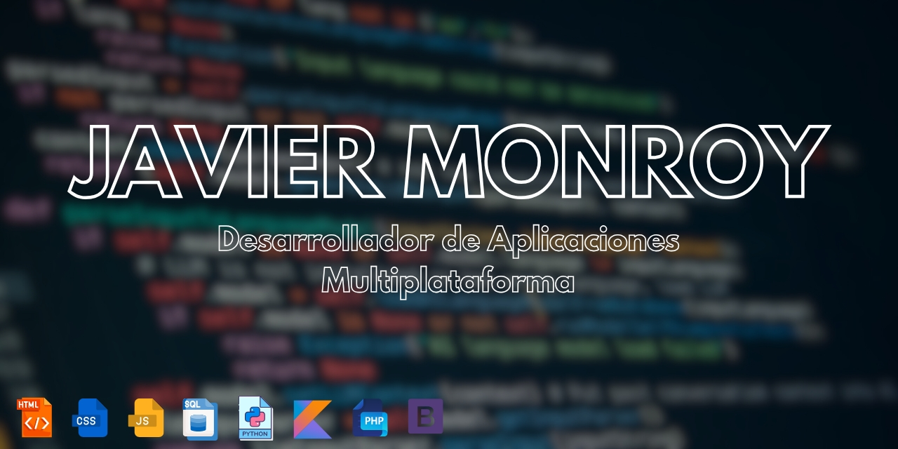

<h1 align="center"><b>¡Hola, soy Javier Monroy! </b></h1>

<h2 margin-top="50px">Sobre Mi</h2>

👋🏼 ¡Hola! Me presento soy Javier Monroy Muñoz, un profesional con formación en Desarrollo de Aplicaciones
Multiplataforma y Sistemas Microinformáticos y Redes, con una especial pasión por el diseño y desarrollo web. Mi
trayectoria académica se complementa con un curso especializado en Confección y Publicación de Páginas Web, área que me
entusiasma y en la que he decidido enfocar mi carrera.

🎯Mi objetivo es seguir creciendo en el campo del desarrollo web
y la gestión de sistemas, aportando mis conocimientos y experiencia para crear soluciones tecnológicas eficientes y de
alto impacto. Estoy siempre en búsqueda de nuevos desafíos que me permitan continuar aprendiendo y desarrollándome
profesionalmente.>

 
<h3>📊 Lenguajes más usados</h3>
## Most Used Languages 📚
 

 
